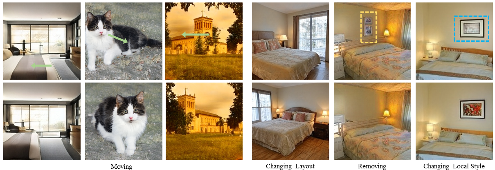

# Spatial Steerability of GANs via Self-Supervision from Discriminator

> Jianyuan Wang, Ceyuan Yang, Yinghao Xu, Yujun Shen, Hongdong Li, and Bolei Zhou <br>



[[Paper](https://arxiv.org/pdf/2301.08455.pdf)]
[[Project Page](https://genforce.github.io/SpacialGAN/)]
[[Demo](https://genforce.github.io/SpacialGAN/)]

The code is coming soon. Stay tuned!


## BibTeX

```bibtex
@article{wang2023spatial,
  title={Spatial Steerability of GANs via Self-Supervision from Discriminator},
  author={Wang, Jianyuan and Yang, Ceyuan and Xu, Yinghao and Shen, Yujun and Li, Hongdong and Zhou, Bolei},
  journal={arXiv preprint arXiv:2301.08455},
  year={2023}
}
```
